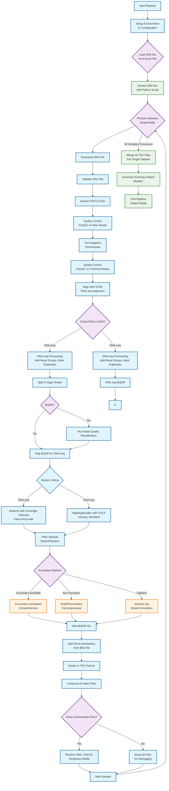

```mermaid
flowchart TD
    A[Start Pipeline] --> B[Setup Environment<br/>& Configuration]
    B --> C{Load SRA IDs<br/>from Excel File}
    C --> D[Extract SRA IDs<br/>with Python Script]
    D --> E{Process Samples<br/>Sequentially}
    
    E --> F[Download SRA File]
    F --> G[Validate SRA File]
    G --> H[Extract FASTQ Files]
    H --> I[Quality Control<br/>FastQC on Raw Reads]
    I --> J[Trim Adapters<br/>Trimmomatic]
    J --> K[Quality Control<br/>FastQC on Trimmed Reads]
    K --> L[Align with STAR<br/>RNA-seq Alignment]
    L --> M{Check RNA or DNA?}
    
    M -->|RNA-seq| N[RNA-seq Processing<br/>Add Read Groups, Mark Duplicates]
    N --> O[Split N Cigar Reads]
    O --> P{BQSR?}
    P -->|No| Q[Skip BQSR for RNA-seq]
    P -->|Yes| R[Run Base Quality Recalibration]
    R --> Q
    
    M -->|DNA-seq| S[DNA-seq Processing<br/>Add Read Groups, Mark Duplicates]
    S --> T[DNA-seq BQSR]
    T --> U
    
    Q --> V{Variant Calling}
    V -->|RNA-seq| W[Mutect2 with Coverage Intervals<br/>Fast & Accurate]
    V -->|DNA-seq| X[HaplotypeCaller with GVCF<br/>Industry Standard]
    
    W --> Y[Filter Variants<br/>VariantFiltration]
    X --> Y
    
    Y --> Z{Annotation Method}
    Z -->|Funcotator Available| AA[Funcotator Annotation<br/>Comprehensive]
    Z -->|No Funcotator| AB[SnpEff Annotation<br/>Transcript-aware]
    Z -->|Fallback| AC[bcftools csq<br/>Simple Annotation]
    
    AA --> AD[Add dbSNP IDs]
    AB --> AD
    AC --> AD
    
    AD --> AE[Add Gene Annotations<br/>from BED file]
    AE --> AF[Export to TSV Format]
    AF --> AG[Compress & Index Files]
    
    AG --> AH{Clean Intermediate Files?}
    AH -->|Yes| AI[Remove SRA, FASTQ,<br/>Temporary BAMs]
    AH -->|No| AJ[Keep All Files<br/>for Debugging]
    
    AI --> AK[Next Sample]
    AJ --> AK
    
    AK --> E
    
    E -->|All Samples Processed| AL[Merge All TSV Files<br/>into Single Dataset]
    AL --> AM[Generate Summary Report<br/>MultiQC]
    AM --> AN[End Pipeline<br/>Output Ready]
    
    %% Styling
    classDef process fill:#e1f5fe,stroke:#01579b,stroke-width:2px
    classDef decision fill:#f3e5f5,stroke:#4a148c,stroke-width:2px
    classDef inputoutput fill:#e8f5e8,stroke:#2e7d32,stroke-width:2px
    classDef annotation fill:#fff3e0,stroke:#ef6c00,stroke-width:2px
    
    class A,B,F,G,H,I,J,K,L,M,N,O,P,Q,R,S,T,U,V,W,X,Y,Z,AA,AB,AC,AD,AE,AF,AG,AH,AI,AJ,AK process
    class C,E,P,M,Z,AH decision
    class D,AL,AM,AN inputoutput
    class AA,AB,AC annotation
```
