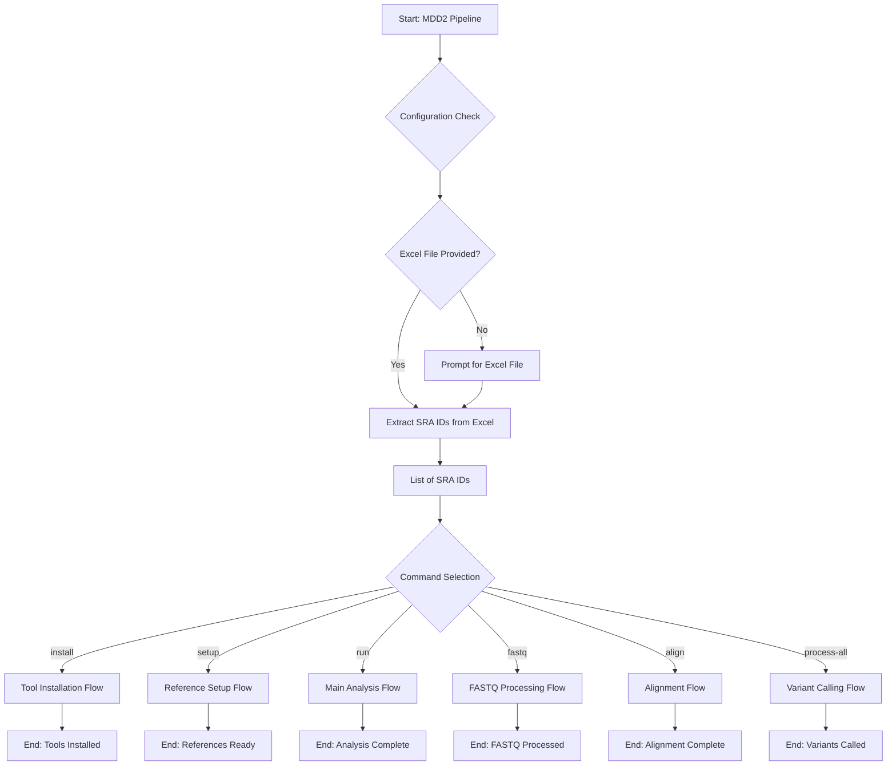
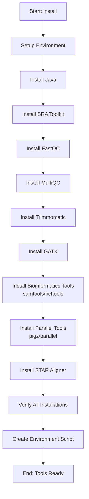
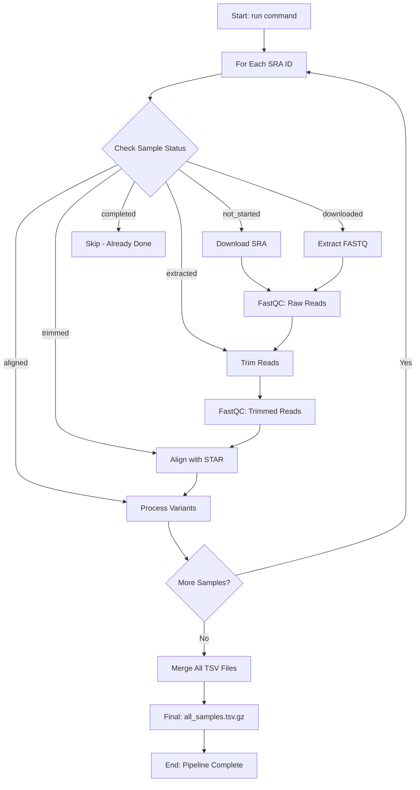
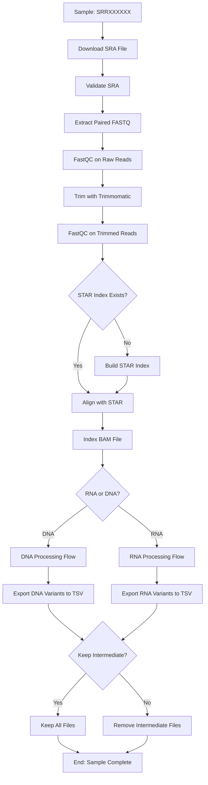
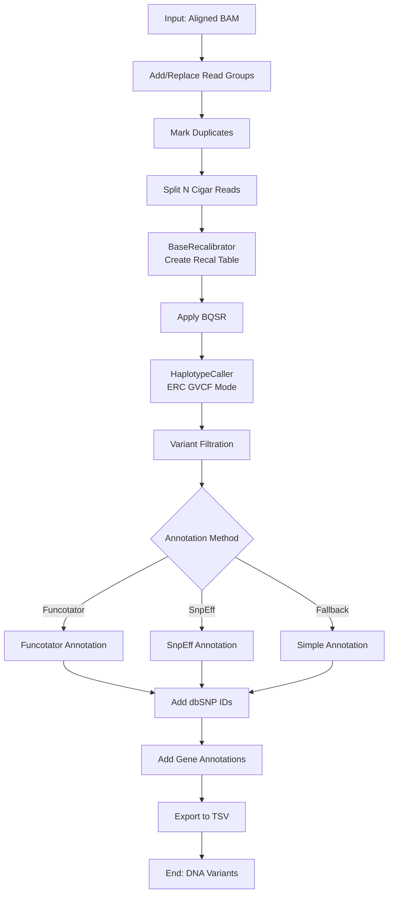
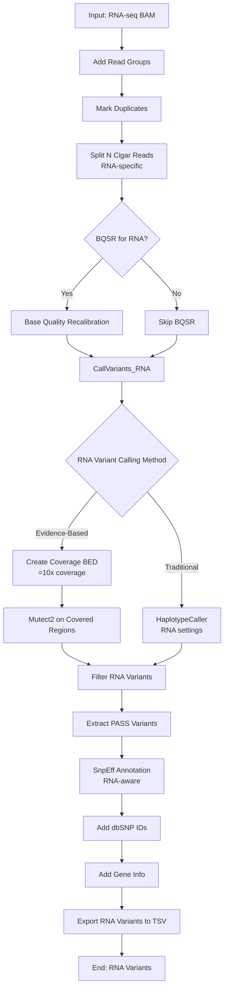
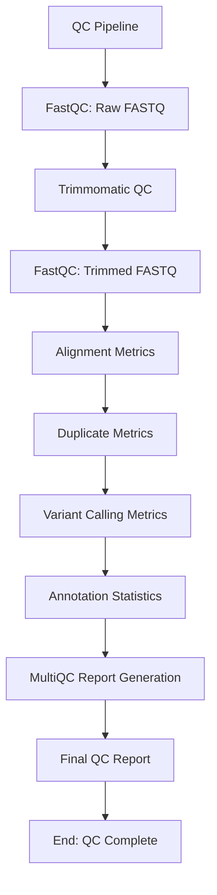
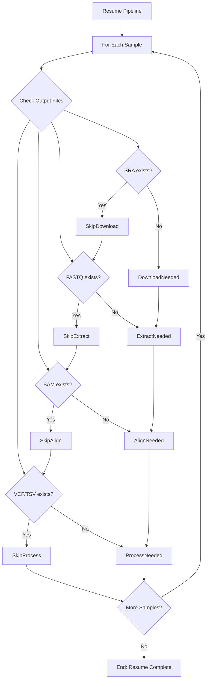
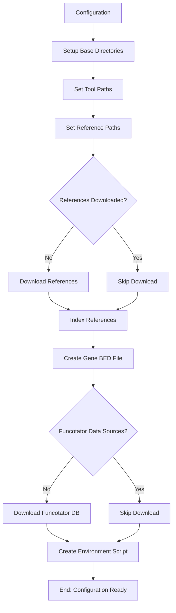
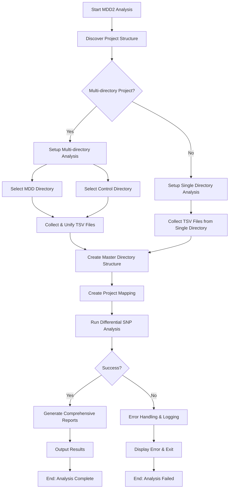

# Overall Pipeline Architecture

# Tool Installation Flow

#  Main Analysis Flow (Sequential Processing)

# Single Sample Processing Pipeline

# DNA-seq Variant Calling Flow

# RNA-seq Variant Calling Flow Evidence-Based

# Quality Control & Reporting Flow

#  Error Handling & Resume Flow

# Configuration & Environment Flow

# Differential Analysis- Overview

